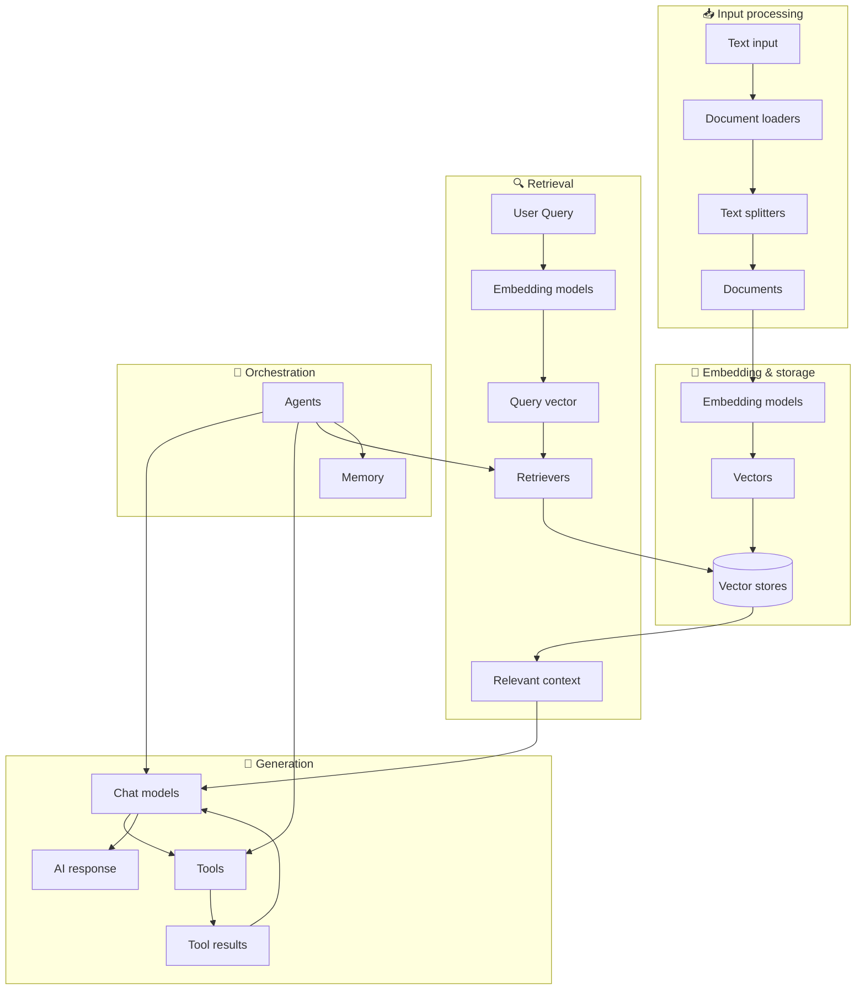

LangChain 的核心思想在于其组件之间的协同工作模式，通过不同组件的构建、连接、包装，实现完整的、类似于一个 Graph 的应用程序（我觉得这也是为什么 LangChain 要把 LangGraph 从预览版中的“高级应用”改为正式版中的"底层架构"的原因）。

因此，尽管目前还没有对 LangGraph 进行深入了解，但是从 LangChain 的角度梳理整个框架的组件架构，仍然是一个比较有意义的事情，也是这篇文章的出发点。

> 因为个人原因，文中对 `agent` 的称呼可能是“智能体”、“代理”（这个可能多一些）以及单纯称呼"agent"，为个人的表达不严谨致歉。

鉴于我自己还是一个研究生，目前正在尝试实现一个针对文献管理、总结和辅助学习的代理应用，很巧的是，它几乎涵盖了下面将要介绍的 LangChain 官方板块拆分的每个部分，所以对于不同内容进行举例的时候，我可能会以这个项目的需求作为案例，进行说明。

# 1. 核心组件生态系统

下面的图是 LangChain 的主要组件彼此链接以构成完整 AI 代理应用的结构图（来自 LangChain 官方文档中对组件架构的介绍文章）：



从输入到输出，我们可以大概将其分为五个板块，下面分别介绍一下。

## 输入处理

实际上在这个图中有两个输入口，为了便于区分和理解，我们以图中的表达方式为准。

我们可以将传入到代理应用中的信息分为两类：

- Input：这类输入的内容通常是需要告知给代理，让代理能够临时掌握，并在回答的时候进行调用，对这样的输入一般返回的是处理结果（如加入到数据库的返回状态、模型是否有将其作为上下文之类的）；
- Query：直译过来是“查询”，是疑问，所以这类输入是由用户发起的、针对需要的信息（如 Input 交给代理的信息、RAG 中的信息等）或者操作（比如查询一条数据库、为一个文档进行纠偏）等要求。

> 这里提到 `Input` 是“临时数据”，其实不够准确，相对于代理本身的记忆和权重来说，这些信息是额外的信息，而不是代理本身的知识，所以说是临时，因为没有通过微调训练，所以相对于微调方案来说，算是临时的、额外的数据。

遵守 LangChain 团队的 Mermaid，这里的第一节“输入处理”描述右上角 “Input processing”的步骤，也就是针对 `Input` 的处理。

---

**输入处理的核心任务是将原始数据转化为结构性文档**。

> **Input processing** – Transform raw data into structured documents

正如前面所说，在这一个板块中，输入的内容通常是需要被转化为结构性文档的 `Raw Data`，以一个文献检索问答系统为例，我们可能会需要：

1. 交给他我们的论文，让他能够对论文进行理解，并针对其中的某些观点或者技术进行解释和分析；
2. 编写一些笔记，比如针对某个模块的思考或者对自己的实验的结构设计，让代理程序能够记住这些内容，在需要的时候主动进行知识点的回忆和关联等。

综上，我们传入的数据类型五花八门，PDF、HTML，甚至 URL 都是可能存在的形式，此外，对于用户的思考、笔记等内容，则可能会使用数据库（比如 SQLite）进行存储和查找。

输入处理板块的核心任务就是对这类数据进行处理，一般情况下，

- 对于 PDF 和 HTML，我们通常采用 `解析+分块` 的方案，将文档拆分为多个彼此链接的 chunks，
- 对于 URL，则需要让代理先访问对应的 URL 的内容，然后根据具体形式进行处理，一般会是一个带有结构性内容的 HTML（比如有导航栏、有评论区），则在分块前需要对其进行数据清洗，排除无效数据，
- 对于数据库，则需要手动编写 DAO，将其封装为工具给代理，或者使用 MCP 工具集，同时对数据库修改、删除等敏感操作进行人工介入（如 `Human-in-the-loop` 中间件）。

---

**如何进行输入处理？ **

虽然 LangChain 框架是一个用于构建代理应用的框架，但是实际上在输入处理这个阶段，并不需要大语言模型的参与，在“RAG问答系统构建方案实践”一文中，我有分别说明如何针对 PDF、HTML、URL 以及 SQLite 数据库，将其作为额外数据保存到应用中，前两者最终存入 Chroma 等向量存储，而数据库则需要额外编写工具实现。

这一段内容我们仅针对当前板块的任务，大致讲一下如何对 PDF 进行内容拆解，对其他数据源的处理方法大体上类似，具体方法请参考相关博客。

我们的整体思路是：对于一个 PDF 文档，我首先通过 `PyPDFLoader` 载入文档：

```python
from langchain_community.document_loaders import PyPDFLoader
from pathlib import Path

file_path = Path("path/to/pdf_file")
loader = PyPDFLoader(str(file_path))

docs = loader.load()

print(len(docs))  # pdf pages length
```

此时，`PyPDFLoader` 将会将 pdf 的每个页面加载为一个 Document 对象（关于 Document 对象的详细说明，请参考“RAG 开发实战”内容），其中包含有页面的字符串内容和相关元数据。

其次，我们通过文本拆分器将其拆分为具有少量链接的、更小的分块：

```python
from langchain_text_splitters import RecursiveCharacterTextSplitter

text_splitter = RecursiveCharacterTextSplitter(
    chunk_size=1000, chunk_overlap=200, add_start_index=True
)
all_splits = text_splitter.split_documents(docs)

print(len(all_splits))  # splits length
```

到这里，对于 PDF 文件的 `Input Processing` 的操作就可以算是结束了，我们获得了一个由 pdf 文档转化得到的 Documents 列表，这个列表的每一个 Document 对象都包含了原文档中的一个部分，我们可以在接下来的 `Embedding & Storage` 的板块中对其进行下一步处理。


## 嵌入和存储

完成输入处理后，接下来对得到的 `splits` 分块存储到向量数据库中。

LLM 进行 RAG 的方式通常是通过高维特征空间中的特征向量相似性实现的，具体方式类似于聚类算法：通过计算两个特征向量之间的余弦相似度、欧式距离等形式的关联度，判断目标信息和查询 query 匹配性是否足够高。因此，**进行相似度计算的首要目标是将所有要被查询的内容都投影到一个维度足够高的特征空间中，这个操作一般通过嵌入模型实现。**

*在这里开始，我们将需要通过 API 调用模型参与项目，可以选用本地 API（参考博客《本地部署LLM方案》）或者调用供应商的API（比较简单，不做赘述）。*
